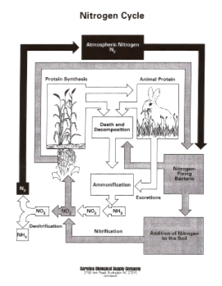
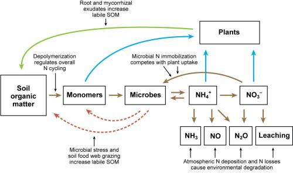

```{r setup, include=FALSE}
knitr::opts_chunk$set(echo = TRUE)
knitr::opts_chunk$set(fig.width=12, fig.height=8) 
library(phyloseq)
library(tidyverse)
library(phylosmith)
```

```{r, echo=F, message=F, include=FALSE}
inc.physeq <- readRDS("data/RDS/incubation_physeq_Aug18.RDS") 

#Rename treatments to more informative titles
data <- data.frame(sample_data(inc.physeq)) %>%
  mutate(treatment = recode(treatment,
                            'Control' = 'Reference',
                            'CompAlfa' = 'Mix')) %>%
  mutate(C_N = C_flash / N_flash, Inorganic_N = NH3 + NO3) %>%
  mutate(TreatmentAndDay = paste(treatment, day))

rownames(data) <- data$i_id
sample_data(inc.physeq) <- data
sample_data(inc.physeq)$day <- as.factor(sample_data(inc.physeq)$day)
sample_data(inc.physeq)$treatment <- as.character(sample_data(inc.physeq)$treatment)

inc.physeq.data <- data.frame(sample_data(inc.physeq))
inc.physeq.data$response.group[inc.physeq.data$day == "0"] <-
  "baseline"
inc.physeq.data$response.group[inc.physeq.data$day %in% c("7", "14", "21")] <-
  "early"
inc.physeq.data$response.group[inc.physeq.data$day %in% c("35", "49", "97")] <-
  "late"

inc.physeq.data <- inc.physeq.data %>%
  mutate(Treatment_Response = paste(treatment, response.group, sep = '_'))

rownames(inc.physeq.data) <- data$i_id
sample_data(inc.physeq) <- inc.physeq.data
```

## The Nitrogen Cycle

The Nitrogen cycle is important in many ecological systems including agriculture and particullarly for organic agriculture. Organic crop production is dependent on soil microbes to generate plant available nitrogen from decomposition of manures, composts or green-manures. 

  

### Step 1: decomposition and ammonium production    
Most nitrogen entering organic agroecosystems is in the form of proteins released from decomposing animal and plant tissues or wastes. Proteases in soil bacteria convert the proteins to polypeptides and amino acids. Deamination of these amino acids produces ammonia (NH~3~) that generally disolves in soil water to generate ammonium ions (NH~4~^+^), one form of inorganic N that plants can utilize for growth. In addition to amino acids, there are other compounds in the soil that go through the ammonification process like nucleic acids, urea, and uric acid. The soil bacteria reponsible for this are called ammonifying bacteria. These include members of the following genra:    
 _Bacillus_   
 _Clostridium_    
 _Proteus_    
 _Pseudomonas_    
 _Streptomyces_    

#### Abundance of ammonifying genera in incubated microcosms
```{r, message=F}
# Subset to desired samples and genera, remove low count taxa. Then rarefy. 
Ammonifying.phy <- subset_samples(inc.physeq, day %in% c("7","14","21","35","49","97")) %>%
  rarefy_even_depth(sample.size = 6000, rngseed = 909090) %>%
  filter_taxa(function(x) sum(x) >= 1, T) %>%
  transform_sample_counts(function(x) {x/sum(x)}) %>%
  subset_taxa(Genus %in% c("Bacillus", "Clostridium", "Proteus", "Pseudomonas", "Streptomyces"))

p <- abundance_heatmap(Ammonifying.phy, classification = NULL, treatment = "Treatment_Response", subset = NULL, transformation = 'none', colors = 'default') 
p
```

##### What is Otu00064? 
```{r}
as.data.frame(Ammonifying.phy@tax_table) %>%
  filter(row.names(.) %in% c("Otu00064", "Otu00149"))
```
### Step 2: oxidation of ammonium to nitrate    
While ammonium may be taken up by plants, the other form of inorganic nitrogen utilized is nitrate NO~3~. The production of nitrate is two step, first oxidation of ammonium to nitrite and then oxidation of nitrite to nitrate. These two steps are carried out by two groups of bacteria, ammonia oxidizing bacteria (AOB) and nitrite oxidizing bacteria (NOB). 

#### AOB associated genera
 _Nitrosomonas_   
 _Nitrosospira_    
 _Nitrosovibrio_    
 _Nitrosolobus_    
 _Nitrosococcus_    

#### Abundance of AOB genera in incubated microcosms
```{r, message=F}
# Subset to desired samples and genera, remove low count taxa. Then rarefy. 
AOB.phy <- subset_samples(inc.physeq, day %in% c("7","14","21","35","49","97")) %>%
  rarefy_even_depth(sample.size = 6000, rngseed = 909090) %>%
  filter_taxa(function(x) sum(x) >= 1, T) %>%
  transform_sample_counts(function(x) {x/sum(x)}) %>%
  subset_taxa(Genus %in% c("Nitrosomonas", "Nitrosospira", "Nitrosovibrio", "Nitrosolobus", "Nitrosococcus"))
  
abundance_heatmap(AOB.phy, classification = NULL, treatment = "Treatment_Response", subset = NULL, transformation = 'none', colors = 'default')
```

##### What is Otu01065? 
```{r}
as.data.frame(AOB.phy@tax_table) %>%
  filter(row.names(.) %in% c("Otu01065"))
```

#### NOB associated genera
 _Nitrobacter_   
 _Nitrospina_    
 _Nitrococcus_    
 _Nitrospira_    

#### Abundance of NOB genera in incubated microcosms
```{r, message=F}
# Subset to desired samples and genera, remove low count taxa. Then rarefy. 
NOB.phy <- subset_samples(inc.physeq, day %in% c("7","14","21","35","49","97")) %>%
  rarefy_even_depth(sample.size = 6000, rngseed = 909090) %>%
  filter_taxa(function(x) sum(x) >= 1, T) %>%
  transform_sample_counts(function(x) {x/sum(x)}) %>%
  subset_taxa(Genus %in% c("Nitrobacter", "Nitrospina", "Nitrococcus", "Nitrospira"))
  
abundance_heatmap(NOB.phy, classification = NULL, treatment = "Treatment_Response", subset = NULL, transformation = 'none', colors = 'default')
```

##### What is Otu00080? 
```{r}
as.data.frame(NOB.phy@tax_table) %>%
  filter(row.names(.) %in% c("Otu00080"))
```

