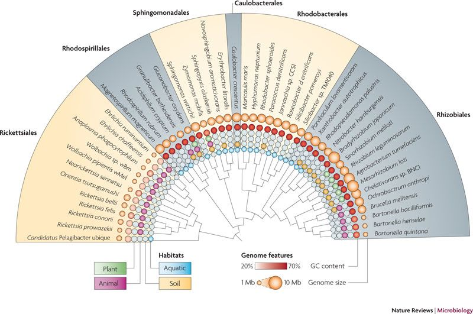
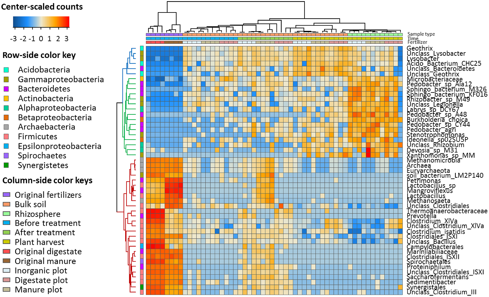

****
>#A thing is right when it tends to preserve the integrity, stability and beauty of the biotic community. It is wrong when it tends otherwise.

#Longitudinal study of soils amended with four treatments of varying nutrient availability

****

# Questions:

### HOW DO AMENDMENTS COMPARE? Are there differences in treatments? Similarities?
1. Differences in community structure as measured by:   
    i) Microbial soil health measurements:  Diversity, Richness   
        A. Dissimilarity measures (uni-frac + NMDS)    
        B. Most abundant species    
    ii) Nutrient soil health measurements   
        A. When and how are these differences most pronounced?       
        B. early and late time points    
    iii) who is always there - core analysis       
    iiii) early and late responders       
        A. do these correlate to chemical data?     
        B. are there environmental conditions that describe the response?        
            + constrained CCA     
            
        C. Where do these responders originate?  Do they persist?        

##Jared's thoughts:

* What is the best way to leverage this data for future work not only on incubation, the STRIPs project for example? 
    + Take advantage of longitudinal aspect
    + Representative sequences and FAPROTAX
    + K and N strategists and how are they distributed across treatments and time? 
    + Nitrogen cycling bacteria distribution 
    + What functional categories can we get from FAPROTAX? EPS, N-Cycling, filament growth?

#Objectives for short term:
1) Use Jin's rep OTUs to construct a tree
2) Use uni-frac for ordinations for the paper
3) Cluster with uni-frac vs. bray-curtis, will capture more information regarding how the OTUs are related. 
4) Include networks in this paper? We could use FAPROTAX to add attributes to the network showing functional information?

###### From thesis:
>In this study, we study the impacts of amendments of both alfalfa and compost, provided at
equal rates of total nitrogen, to a soil but with differing C: N ratios chosen to result in
immobilization (compost) or mineralization (alfalfa). We characterize both the chemical and
microbial response to these amendments and hypothesize that specific microbial
communities will respond to initial nitrogen and carbon availability and that this membership
will be specific to varying amendments. We expect that these distinct early microbial
responders will dominate soil microbial communities in response to organic amendments and
will decrease in abundance through time. Our objective was to characterize these early
responding microbial communities for various organic amendments and to identify potential
microbial membership within organic amendments that may be involved in plant nutrient
availability.

## Lit Review and desired figures   
https://www.nature.com/articles/nrmicro2367#f1    
   
This figure could be of a response group, the habitat info replaced with treatment, the GC content with ??? and the genome size with relative abundance

****    

https://academic.oup.com/femsec/article/94/4/fiy027/4867966#116819013 

>Bulk soil and maize rhizosphere resistance genes, mobile genetic elements and microbial communities are differently impacted by organic and inorganic fertilization      

Identified responding OTUS, used edgeR

>Major phylogenetic changes detected at phylum/class levels and responding gen-
era/OTUs were extracted by the likelihood ratio test after neg-
ative binomial generalized linear modeling (nbGLM) of the raw
counts with the false discovery rate (FDR) adjusted
p-values (p-value < 0.05, R package edgeR, Robinson, McCarthy and Smyth 2010)                  

   

What is the `likelihood ratio test`?   
https://hbctraining.github.io/DGE_workshop/lessons/08_DGE_LRT.html