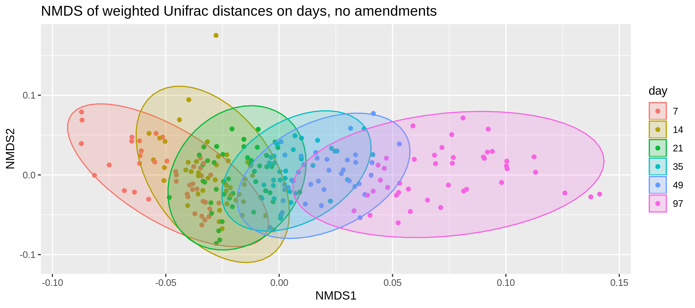
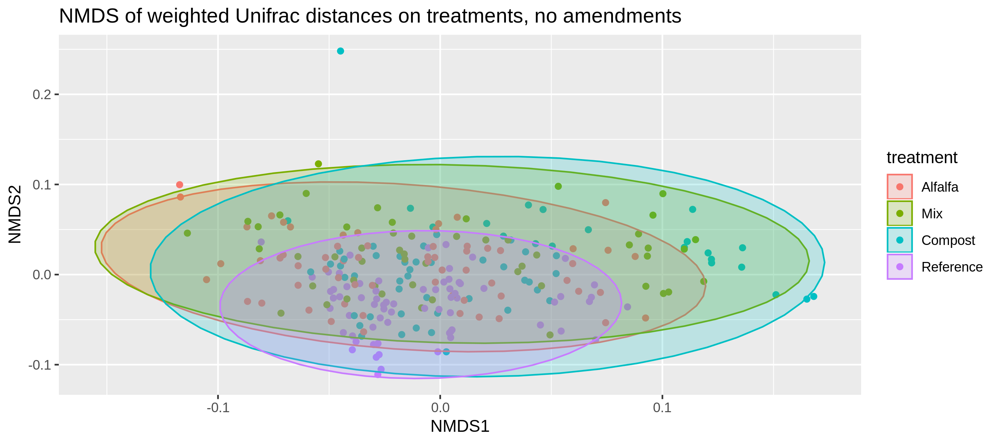
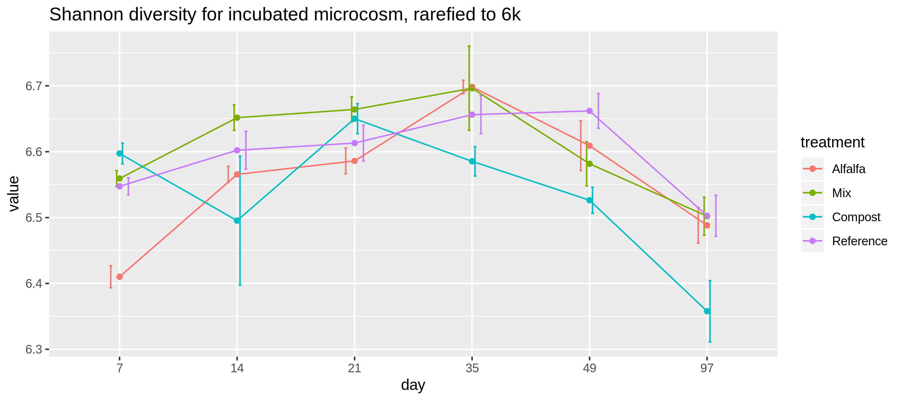
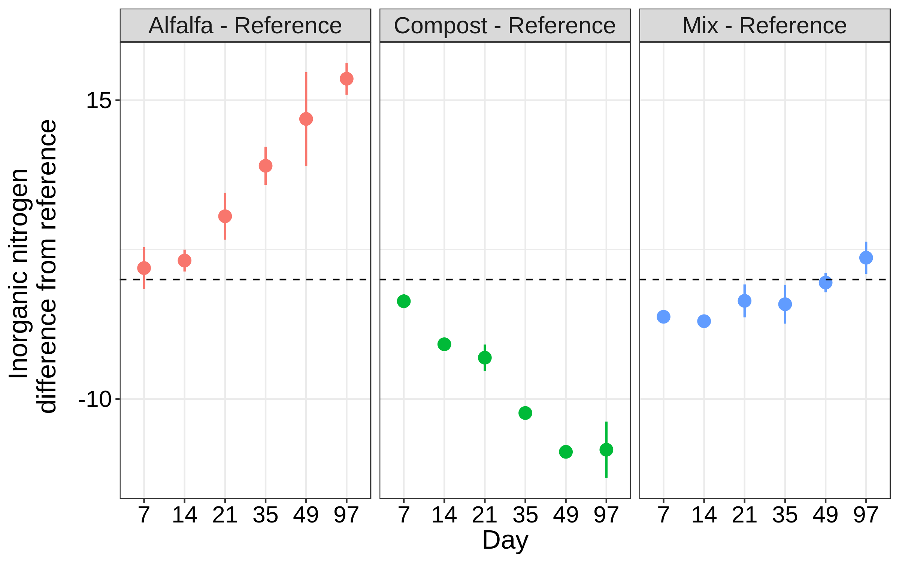

------------------------------------------------------------------------

> A thing is right when it tends to preserve the integrity, stability and beauty of the biotic community. It is wrong when it tends otherwise.
> ============================================================================================================================================

How much does the soil microbiome/nutrients change from amendment?
==================================================================

PCoA of all amendments and baseline soils and time
==================================================

First ordination using weighted unifrac and PCoA, there are no
amendments and reads have been rarified to 6k

 Second ordinations using the raw
object, note that day is not a factor and that this has not been
rarefied.

NMDS of all amendments, baseline soils and time
===============================================

Same as above, but now I used NMDS instead of PCoA for the ordination  

 \# Shannon Diversity of incubated
microcosms. There is an OTU in the compost day 14 samples that has super
high abundance, likely needs removed.
 \# Inorganic nitrogen

Anova results on the linear mixed effect model defined by:
Inorganic\_N~treatment \* day, random=~1|replication

<table>
<thead>
<tr class="header">
<th align="left"></th>
<th align="right">numDF</th>
<th align="right">denDF</th>
<th align="right">F-value</th>
<th align="right">p-value</th>
</tr>
</thead>
<tbody>
<tr class="odd">
<td align="left">(Intercept)</td>
<td align="right">1</td>
<td align="right">253</td>
<td align="right">5557.0515</td>
<td align="right">&lt;.0001</td>
</tr>
<tr class="even">
<td align="left">treatment</td>
<td align="right">3</td>
<td align="right">253</td>
<td align="right">10708.1487</td>
<td align="right">&lt;.0001</td>
</tr>
<tr class="odd">
<td align="left">day</td>
<td align="right">5</td>
<td align="right">253</td>
<td align="right">2539.9503</td>
<td align="right">&lt;.0001</td>
</tr>
<tr class="even">
<td align="left">treatment:day</td>
<td align="right">15</td>
<td align="right">253</td>
<td align="right">488.1453</td>
<td align="right">&lt;.0001</td>
</tr>
</tbody>
</table>
