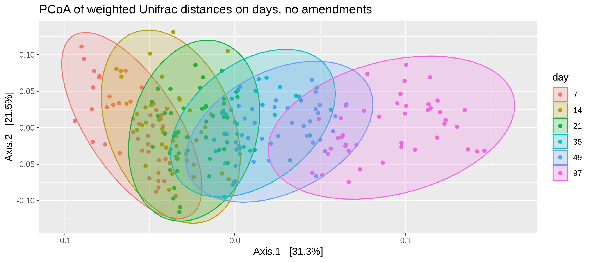
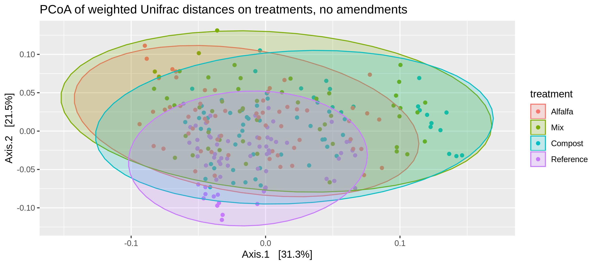
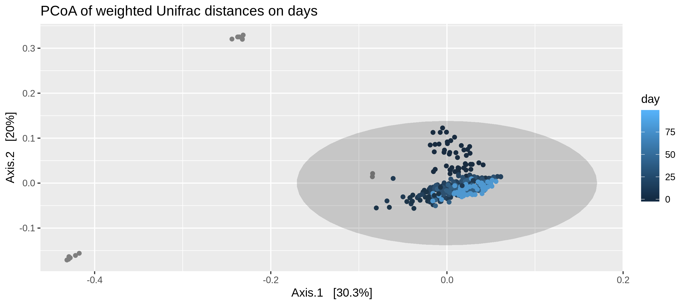
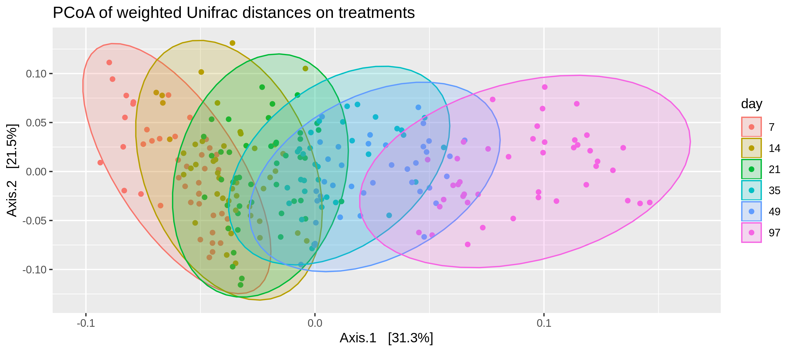

------------------------------------------------------------------------

> A thing is right when it tends to preserve the integrity, stability and beauty of the biotic community. It is wrong when it tends otherwise.
> ============================================================================================================================================

How much does the soil microbiome/nutrients change from amendment?
==================================================================

NMDS of all amendments and baseline soils and time
--------------------------------------------------

First ordination using weighted unifrac and PCoA, there are no
amendments and reads have been rarified to 6k

 Second ordinations using the raw
object, note that day is not a factor and that this has not been
rarefied.

